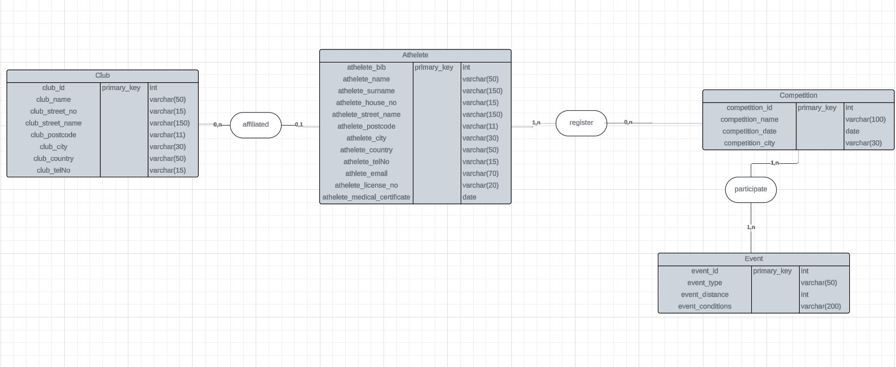

# Examen : **Modélisation de Données**

---

**Nom de l'étudiant :**  
<span style="color:blue;">Keenan MARTIN</span>

**Date :**  
<span style="background-color:yellow;">22/08/2024</span>

---

## PARTIE PRATIQUE:

<h2 style="color:blue;">Exercice 1:</h2>

### On commence par le dictionnaire de données:

| Nom de la donnée           | Format         | Longueur | Type        | Règle de calcul | Règle de gestion | Document |
| -------------------------- | -------------- | -------- | ----------- | --------------- | ---------------- | -------- |
| **product_reference**      | Numérique      |          | Élémentaire | Auto-incrément  |                  | -        |
| **product_name**           | Alphanumérique | 50       | Élémentaire | -               |                  | -        |
| **product_description**    | Alphanumérique | 150      | Élémentaire | -               |                  | -        |
| **product_price**          | Numérique      |          | Élémentaire | -               |                  | -        |
| **labor_hours**            | Numérique      |          | Élémentaire | -               |                  | -        |
| **average_purchase_price** | Numérique      |          | Élémentaire | -               |                  | -        |
| **supplier_id**            | Numerique      |          | Élémentaire | Auto-increment  |                  | -        |
| **supplier_name**          | Alphanumérique | 100      | Élémentaire | -               |                  | -        |
| **supplier_house_no**      | Alphanumérique | 15       | Élémentaire | -               |                  | -        |
| **supplier_street_name**   | Alphanumérique | 150      | Élémentaire | -               |                  | -        |
| **supplier_postcode**      | Alphanumérique | 11       | Élémentaire | -               |                  | -        |
| **supplier_city**          | Alphanumérique | 30       | Élémentaire | -               |                  | -        |
| **supplier_country**       | Alphanumérique | 50       | Élémentaire | -               |                  | -        |
| **supplier_product_ref**   | Alphanumérique | 50       | Élémentaire | -               |                  | -        |
| **supplier_price**         | Numérique      |          | Élémentaire | -               |                  | -        |
| **order_id**               | Numerique      |          | Élémentaire | Auto-increment  |                  | -        |
| **order_date**             | Date           |          | Élémentaire | -               |                  | -        |
| **order_quantity**         | Numérique      |          | Élémentaire | -               |                  | -        |
| **expected_delivery_date** | Date           |          | Élémentaire | -               |                  | -        |

### Puis par le Modele Conceptuel des Données:


### On continue par le Modele Logique des Données:


### On fini par le Modele Physique des Données:

PRODUCT (<u>product_reference</u>, product_name, product_description, product_price, labour_hours, average_purchase_price)

SUPPLIER (<u>supplier_id</u>, supplier_name, supplier_house_no, supplier_street_name, supplier_postcode, supplier_city, supplier_country)

ORDERTABLE (<u>order_id</u>, order_date, expected_delivery_date)

ORDER_PRODUCT (<u>#order_id, #product_reference</u>, order_quantity)

PRODUCT_SUPPLIER (<u>#product_reference, #supplier_id</u>, supplier_product_ref, supplier_price)
<br>
</br>

##### Voici les script POSTGRESQL

```sql
CREATE DATABASE XProd

CREATE TABLE Product (
    product_reference SERIAL PRIMARY KEY,
    product_name VARCHAR(50) NOT NULL,
    product_description VARCHAR(150),
    product_price DECIMAL(10, 2) NOT NULL,
    labor_hours DECIMAL(5, 2),
    average_purchase_price DECIMAL(10, 2)
);

INSERT INTO Product (product_name, product_description, product_price, labor_hours, average_purchase_price)
VALUES
('Laptop Model A', 'Laptop with 16GB RAM', 1200.00, 10.5, NULL),
('SSD', '1TB USB 3.0 SSD', 80.00, NULL, 50.00);

CREATE TABLE Supplier (
    supplier_id SERIAL PRIMARY KEY,
    supplier_name VARCHAR(50) NOT NULL,
    supplier_house_no VARCHAR(15),
    supplier_street_name VARCHAR(150) NOT NULL,
    supplier_postcode VARCHAR(11) NOT NULL,
    supplier_city VARCHAR(30) NOT NULL,
    supplier_country VARCHAR(50) NOT NULL
);

INSERT INTO Supplier (supplier_name, supplier_house_no, supplier_street_name, supplier_postcode, supplier_city, supplier_country)
VALUES
('Tech Supplies Ltd', '123', 'Tech Street', 'NG5633', 'Techville', 'UK'),
('Office Comfort Inc', '456', 'Comfort Ave', 'BT499FE', 'CompfyChair', 'UK');

CREATE TABLE OrderTable (
    order_id SERIAL PRIMARY KEY,
    order_date DATE NOT NULL,
    expected_delivery_date DATE
);

INSERT INTO OrderTable (order_date, expected_delivery_date)
VALUES
('2024-08-01', '2024-08-05'),
('2024-08-02', '2024-08-10');

CREATE TABLE Order_Product (
    order_id INT NOT NULL,
    product_reference INT NOT NULL,
    order_quantity INT NOT NULL,
    PRIMARY KEY (order_id, product_reference),
    FOREIGN KEY (order_id) REFERENCES OrderTable(order_id),
    FOREIGN KEY (product_reference) REFERENCES Product(product_reference)
);

INSERT INTO Order_Product (order_id, product_reference, order_quantity)
VALUES
(1, 1, 2),
(1, 2, 5),
(2, 1, 1),
(2, 2, 3);

CREATE TABLE Product_Supplier (
    product_reference INT NOT NULL,
    supplier_id INT NOT NULL,
    supplier_product_ref VARCHAR(50),
    supplier_price DECIMAL(10, 2),
    PRIMARY KEY (product_reference, supplier_id),
    FOREIGN KEY (product_reference) REFERENCES Product(product_reference),
    FOREIGN KEY (supplier_id) REFERENCES Supplier(supplier_id)
);

INSERT INTO Product_Supplier (product_reference, supplier_id, supplier_product_ref, supplier_price)
VALUES
(1, 1, 'LAPTOP_A_123', 1100.00),
(2, 2, 'HDD_1TB_321', 70.00);

```

#### Voici une requete qui fonctionne

```sql
SELECT
    p.product_reference,
    p.product_name,
    p.product_description,
    ps.supplier_product_ref,
    ps.supplier_price,
    s.supplier_name,
    s.supplier_postcode,
    s.supplier_city
FROM
    Product p
JOIN
    Product_Supplier ps ON p.product_reference = ps.product_reference
JOIN
    Supplier s ON ps.supplier_id = s.supplier_id
WHERE
    s.supplier_name = 'Tech Supplies Ltd'
    AND p.product_name = 'Laptop Model A';
```

---

<h2 style="color:blue;">Exercice 2:</h2>

### On commence par le dictionnaire de données:

| Nom de la donnée                | Format         | Longueur | Type        | Règle de calcul | Document |
| ------------------------------- | -------------- | -------- | ----------- | --------------- | -------- |
| **athlete_bib**                 | Numérique      |          | Élémentaire | Auto-incrément  | -        |
| **athlete_name**                | Alphanumérique | 50       | Élémentaire | -               | -        |
| **athlete_surname**             | Alphanumérique | 60       | Élémentaire | -               | -        |
| **athlete_house_no**            | Alphanumérique | 15       | Élémentaire | -               | -        |
| **athlete_street_name**         | Alphanumérique | 150      | Élémentaire | -               | -        |
| **athlete_postcode**            | Alphanumérique | 11       | Élémentaire | -               | -        |
| **athlete_city**                | Alphanumérique | 30       | Élémentaire | -               | -        |
| **athlete_country**             | Alphanumérique | 50       | Élémentaire | -               | -        |
| **athlete_telNo**               | Alphanumérique | 15       | Élémentaire | -               | -        |
| **athlete_email**               | Alphanumérique | 70       | Élémentaire | -               | -        |
| **athlete_licence_no**          | Alphanumérique | 20       | Élémentaire | -               | -        |
| **athlete_medical_certificate** | Date           |          | Élémentaire | -               | -        |
| **registration_date**           | Date           |          | Élémentaire | -               | -        |
| **competition_id**              | Numérique      |          | Élémentaire | Auto-incrément  | -        |
| **competition_name**            | Alphanumérique | 100      | Élémentaire | -               | -        |
| **competition_date**            | Date           |          | Élémentaire | -               | -        |
| **competition_city**            | Alphanumérique | 30       | Élémentaire | -               | -        |
| **event_id**                    | Numérique      |          | Élémentaire | Auto-incrément  | -        |
| **event_type**                  | Alphanumérique | 50       | Élémentaire | -               | -        |
| **event_distance**              | Numérique      |          | Élémentaire | -               | -        |
| **event_conditions**            | Alphanumérique | 200      | Élémentaire | -               | -        |
| **club_id**                     | Numérique      |          | Élémentaire | Auto-increment  | -        |
| **club_name**                   | Alphanumérique | 50       | Élémentaire | -               | -        |
| **date_of_affiliation**         | Date           |          | Élémentaire | -               | -        |
| **aclub_street_no**             | Alphanumérique | 15       | Élémentaire | -               | -        |
| **club_street_name**            | Alphanumérique | 150      | Élémentaire | -               | -        |
| **club_postcode**               | Alphanumérique | 11       | Élémentaire | -               | -        |
| **club_city**                   | Alphanumérique | 30       | Élémentaire | -               | -        |
| **club_country**                | Alphanumérique | 50       | Élémentaire | -               | -        |
| **club_telNo**                  | Alphanumérique | 15       | Élémentaire | -               | -        |

### Puis par le Modele Conceptuel des Données:



### Puis par le Modele Logique des Données:


### On fini par le Modele Physique des Données:

ATHELETE (<u>athelete_bib</u>, athelete_name, athelete_surname, athelete_house_no, athelete_street_name, athelete_postcode, athelete_city, athelete_country, athelete_telNo, athelete_email, athelete_license_no, athelete_medical_certificate)

CLUB (<u>club_id</u>, club_name, aclub_street_no, club_street_name, club_postcode, club_city, club_country, club_telNo)

COMPETITION (<u>competition_id</u>, competition_name, competition_date, competition_city)

EVENT (<u>event_id</u>, event_type, event_distance, event_conditions)

REGISTER (<u>#athelete_bib, #competition_id</u>, registration_date)

PARTICIPATE (<u>#competition_id, #event_id</u>)

AFFILIATED (<u>#athelete_bib</u>, #club_id, date_of_affiliation)
<br/>
<br/>

##### Voici les script POSTGRESQL

```sql
CREATE DATABASE SportFederation

CREATE TABLE ATHELETE (
    athelete_bib SERIAL PRIMARY KEY,
    athelete_name VARCHAR(50) NOT NULL,
    athelete_surname VARCHAR(50) NOT NULL,
    athelete_house_no VARCHAR(10),
    athelete_street_name VARCHAR(100),
    athelete_postcode VARCHAR(20),
    athelete_city VARCHAR(50),
    athelete_country VARCHAR(50),
    athelete_telNo VARCHAR(20),
    athelete_email VARCHAR(100),
    athelete_license_no VARCHAR(50),
    athelete_medical_certificate DATE NOT NULL
);

INSERT INTO ATHELETE (athelete_name, athelete_surname, athelete_house_no, athelete_street_name, athelete_postcode, athelete_city, athelete_country, athelete_telNo, athelete_email, athelete_license_no, athelete_medical_certificate)
VALUES ('John', 'Doe', '123', 'Main St', '12345', 'Plymouth City', ' Country', '123-456-7890', 'john.doe@gmail.com', 'PLY2ER', '2024-09-04');

INSERT INTO ATHELETE (athelete_name, athelete_surname, athelete_house_no, athelete_street_name, athelete_postcode, athelete_city, athelete_country, athelete_telNo, athelete_email, athelete_license_no, athelete_medical_certificate)
VALUES ('Jane', 'Smith', '456', 'Data St', '67890', 'London', 'UK', '987-654-3210', 'jane.smith@gmail.com', NULL, '2024-09-04');

CREATE TABLE CLUB (
    club_id SERIAL PRIMARY KEY,
    club_name VARCHAR(100) NOT NULL,
    club_street_no VARCHAR(10),
    club_street_name VARCHAR(100),
    club_postcode VARCHAR(20),
    club_city VARCHAR(50),
    club_country VARCHAR(50),
    club_telNo VARCHAR(20)
);

INSERT INTO CLUB (club_name, club_street_no, club_street_name, club_postcode, club_city, club_country, club_telNo)
VALUES ('Runner Club', '1', 'Runner St', '11111', 'Runner City', 'Runner Country', '111-222-3333');

INSERT INTO CLUB (club_name, club_street_no, club_street_name, club_postcode, club_city, club_country, club_telNo)
VALUES ('Speedsters', '2', 'Fast Lane', '22222', 'Speed City', 'Speed Country', '222-333-4444');


CREATE TABLE COMPETITION (
    competition_id SERIAL PRIMARY KEY,
    competition_name VARCHAR(100) NOT NULL,
    competition_date DATE NOT NULL,
    competition_city VARCHAR(50)
);

INSERT INTO COMPETITION (competition_name, competition_date, competition_city)
VALUES ('Spring Marathon', '2024-04-15', 'Marathon City');

INSERT INTO COMPETITION (competition_name, competition_date, competition_city)
VALUES ('Summer Triathlon', '2024-07-20', 'Triathlon Town');

CREATE TABLE EVENT (
    event_id SERIAL PRIMARY KEY,
    event_type VARCHAR(50) NOT NULL,
    event_distance DECIMAL(5, 2),
    event_conditions TEXT
);

INSERT INTO EVENT (event_type, event_distance, event_conditions)
VALUES ('Marathon', 42.195, 'Clear weather, road race');

INSERT INTO EVENT (event_type, event_distance, event_conditions)
VALUES ('Triathlon', 51.5, 'Swim, Bike, Run');


CREATE TABLE REGISTER (
    athelete_bib INT REFERENCES ATHELETE(athelete_bib) ,
    competition_id INT REFERENCES COMPETITION(competition_id),
    registration_date DATE NOT NULL,
    PRIMARY KEY (athelete_bib, competition_id)
);

INSERT INTO REGISTER (athelete_bib, competition_id, registration_date)
VALUES (1, 1, '2024-03-01');

INSERT INTO REGISTER (athelete_bib, competition_id, registration_date)
VALUES (2, 2, '2024-06-01');

CREATE TABLE PARTICIPATE (
    competition_id INT REFERENCES COMPETITION(competition_id) ,
    event_id INT REFERENCES EVENT(event_id),
    PRIMARY KEY (competition_id, event_id)
);

INSERT INTO PARTICIPATE (competition_id, event_id)
VALUES (1, 1);

INSERT INTO PARTICIPATE (competition_id, event_id)
VALUES (2, 2);

CREATE TABLE AFFILIATED (
    athelete_bib INT REFERENCES ATHELETE(athelete_bib) ,
    club_id INT REFERENCES CLUB(club_id),
    date_of_affiliation DATE NOT NULL,
    PRIMARY KEY (athelete_bib)
);

INSERT INTO AFFILIATED (athelete_bib, club_id, date_of_affiliation)
VALUES (1, 1, '2023-01-15');
INSERT INTO AFFILIATED (athelete_bib, club_id, date_of_affiliation)
VALUES (2, 2, '2023-02-20');


```

---
